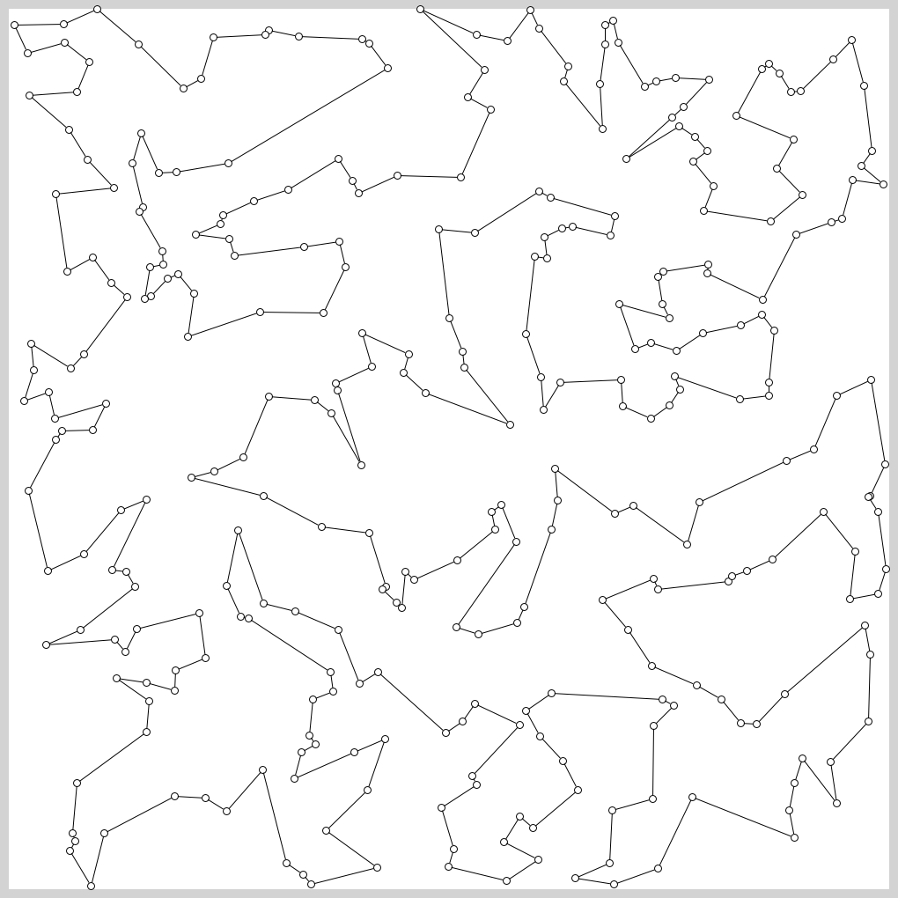
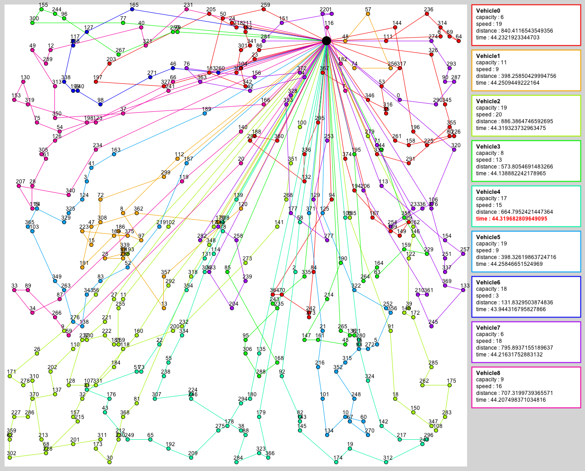
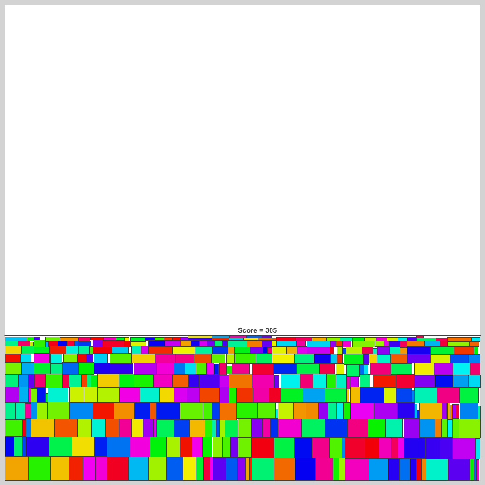
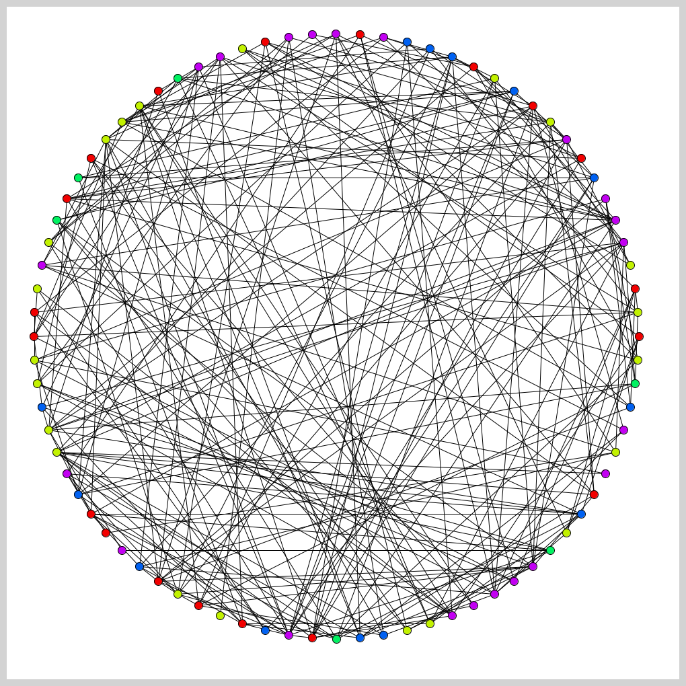

# Typical-MM
TopCoder の Marathon Match に最近ハマっています．皆んなやろう．練習問題のようなものを作ってみました．何から始めたら良いか分からない方のお役に立てれば幸いです．
- [過去問](https://community.topcoder.com/longcontest/stats/?module=MatchList)  
- [TopCoder Event](https://www.topcoder.com/community/events/)

テスタは Marathon Match 風にしています．使い方は本家と同じなので診断人さんのブログが参考になります．
- [じじいのプログラミング - TopCoderマラソンマッチのはじめかた](http://shindannin.hatenadiary.com/entry/2014/10/05/003714)  
  
最適化問題で検索してヒットしたものをテスタにしているだけなので，その問題の研究など理論的な事は全く分かりません．何か間違っていれば指摘していただけるとありがたいです．  
  

## Traveling Salesman
巡回セールスマン問題です．有名です．  

## Vehicle Routing
配送計画を考える問題です．巡回セールスマン問題と少し似ています．  

## Rectangle Packing
長方形を良い感じで詰め込む問題です．  

## Graph Coloring
グラフの彩色問題です．

