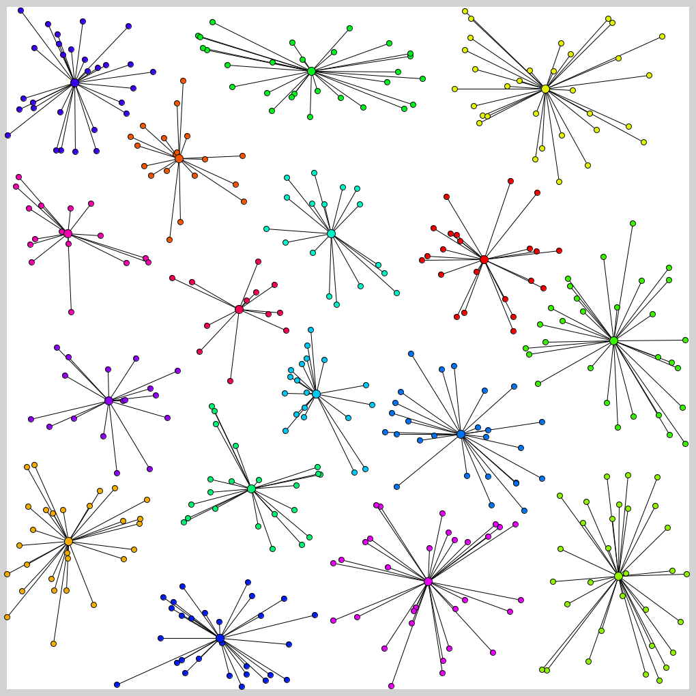
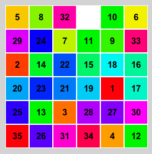
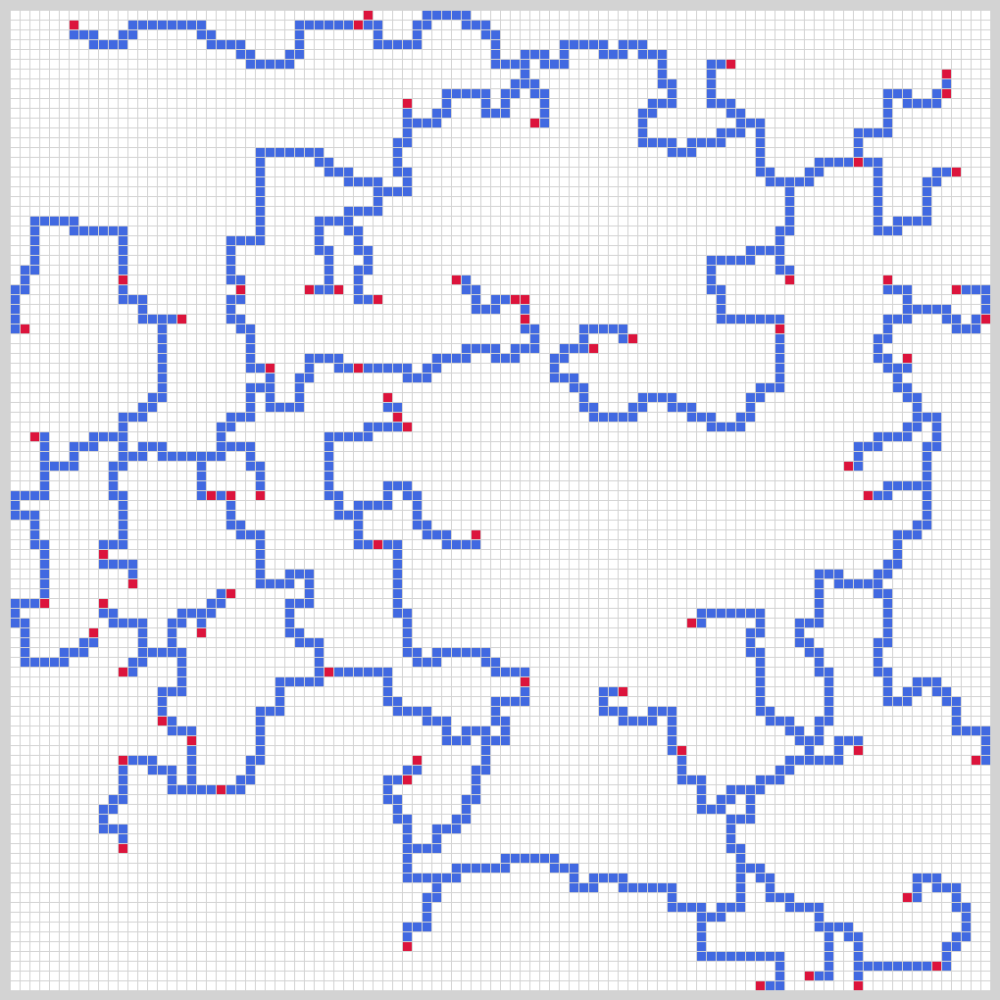
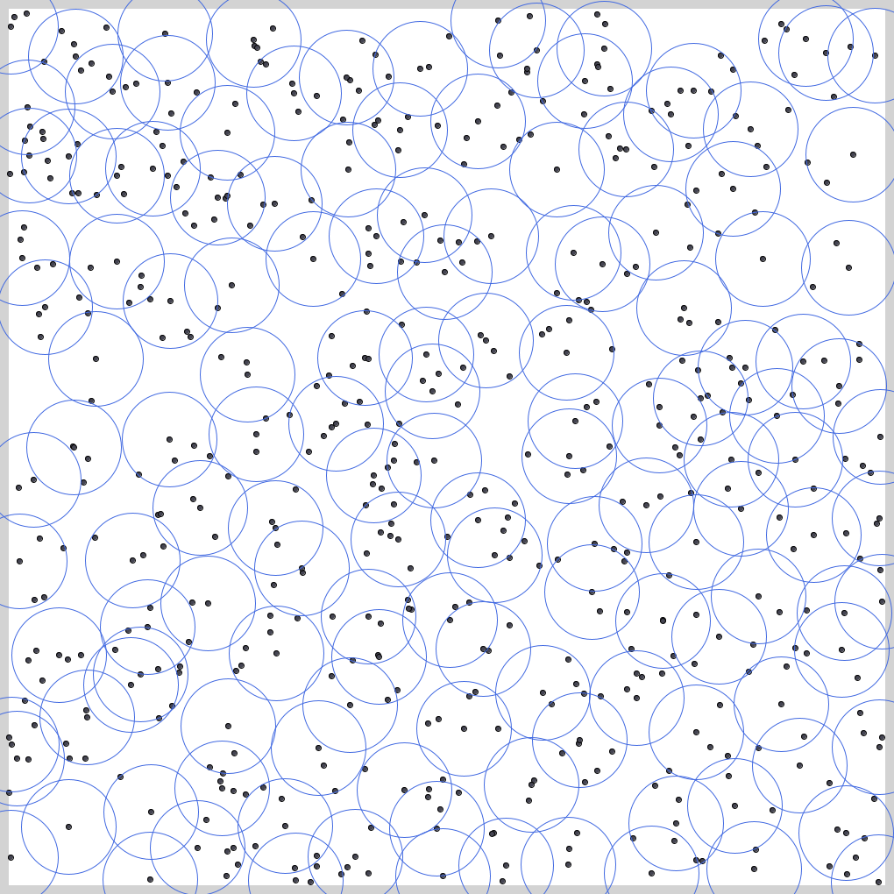

# Typical-MM
TopCoder の Marathon Match に最近ハマっています．皆んなやろう．練習問題のようなものを作ってみました．何から始めたら良いか分からない方のお役に立てれば幸いです．
- [過去問](https://community.topcoder.com/longcontest/stats/?module=MatchList)  
- [TopCoder Event](https://www.topcoder.com/community/events/)

テスタは Marathon Match 風にしています．使い方は本家と同じなので診断人さんのブログが参考になります．
- [じじいのプログラミング - TopCoderマラソンマッチのはじめかた](http://shindannin.hatenadiary.com/entry/2014/10/05/003714)  
  
最適化問題で検索してヒットしたものをテスタにしているだけなので，理論的な事は全く分かりません．何か間違っていれば指摘していただけるとありがたいです．  
  

## [Traveling Salesman](TravelingSalesman/)
巡回セールスマン問題です．有名です．  

## [Vehicle Routing](VehicleRouting/)
配送計画を考える問題です．巡回セールスマン問題と少し似ています．  

## [Rectangle Packing](RectanglePacking/)
長方形を良い感じで詰め込む問題です．  

## [Graph Coloring](GraphColoring/)
グラフの彩色問題です．  

## [Clustering](Clustering/)
クラスタリングです．  

## [Sliding Puzzle](SlidingPuzzle)
15-Puzzle(スライドパズル)のN×Mバージョン．  

## [Rectilinear Steiner Tree](RectilinearSteinerTree/)
シュタイナー木のカクカクしたタイプのやつです．  

## [Disk Covering](DiskCovering/)
円で点をカバーする問題です．  

