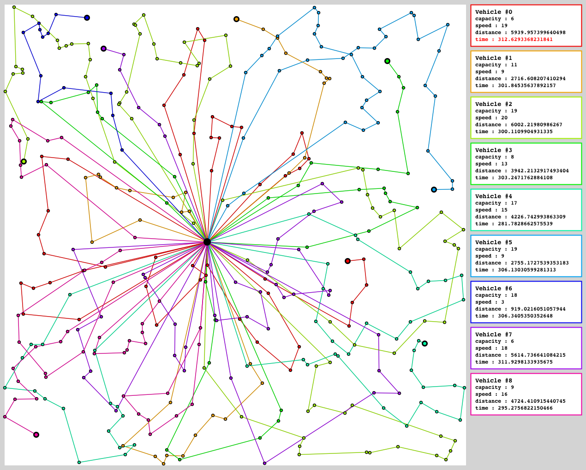
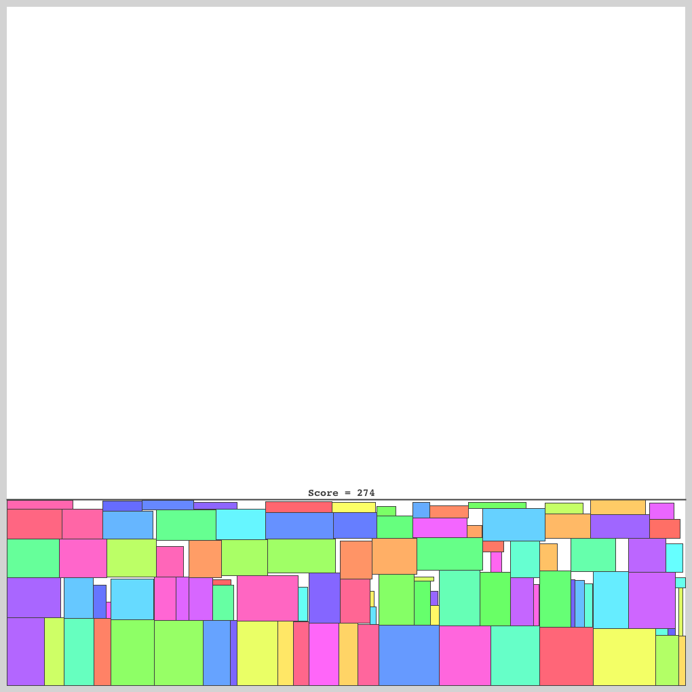
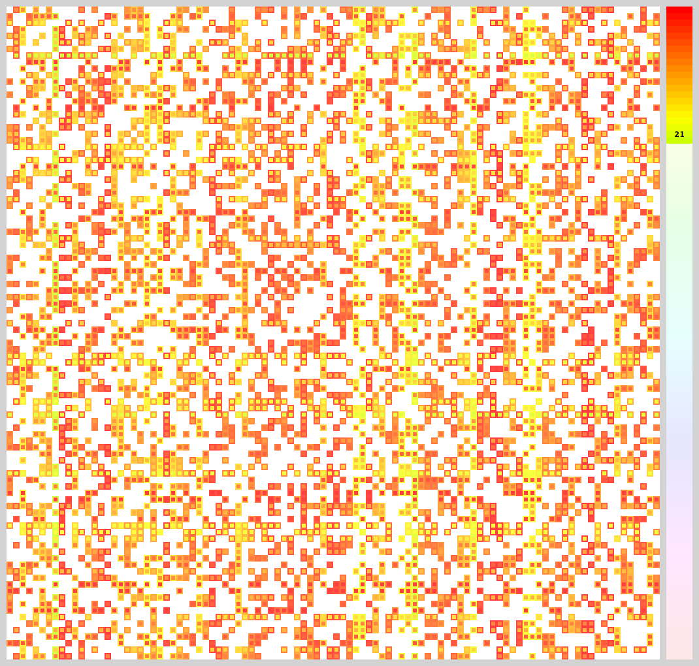
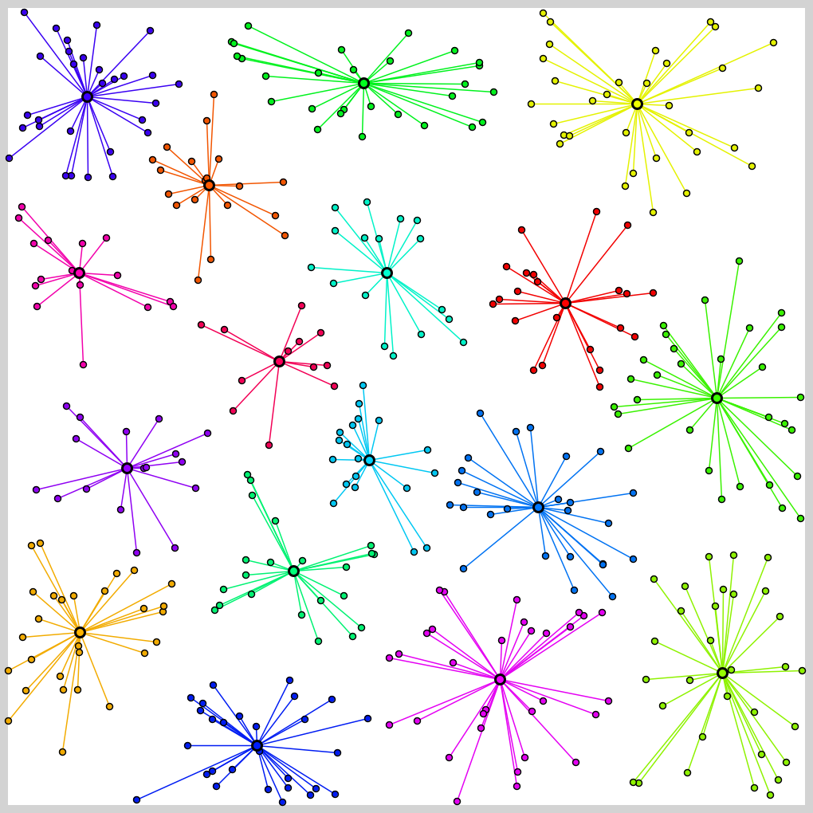

# MM-Tester 

## 環境

### Ubuntu
```
$ sudo apt update
$ sudo apt install default-jre default-jdk build-essential git
```

### macOS
1. [Xcode](https://apps.apple.com/jp/app/xcode/id497799835?mt=12)とCommand Line Tools
```
$ xcode-select --install
```
2. [Homebrew](https://brew.sh)
```
$ brew update
$ brew install git
$ brew cask install java
```

## 使い方

### 入手 & テスタのビルド
```
$ git clone --depth 1 https://github.com/kosakkun/MM-Tester.git
$ cd MM-Tester
$ ./gradlew build
```

### 問題文が読めない時
Githubが数式に対応していないので，[ここ](http://marxi.co)とかに貼り付けて読んでください．

### 問題毎のファイル構成
```
.
├── README.md
├── build.gradle
├── build
│   └── libs
│       └── Tester.jar
├── tester
│   └── Tester.java
└── solver
    ├── cpp
    │   ├── run.sh
    │   └── main.cpp
    ├── java
    │   ├── run.sh
    │   └── Main.java
    └── python
        ├── run.sh
        └── main.py
```

## 問題
### [Traveling Salesman](TravelingSalesman/)


### [Vehicle Routing](VehicleRouting/) 


### [Rectangle Packing](RectanglePacking/)


### [Graph Coloring](GraphColoring/)


### [Clustering](Clustering/)


### [Sliding Puzzle](SlidingPuzzle)


### [Rectilinear Steiner Tree](RectilinearSteinerTree/)


### [Disk Covering](DiskCovering/)

