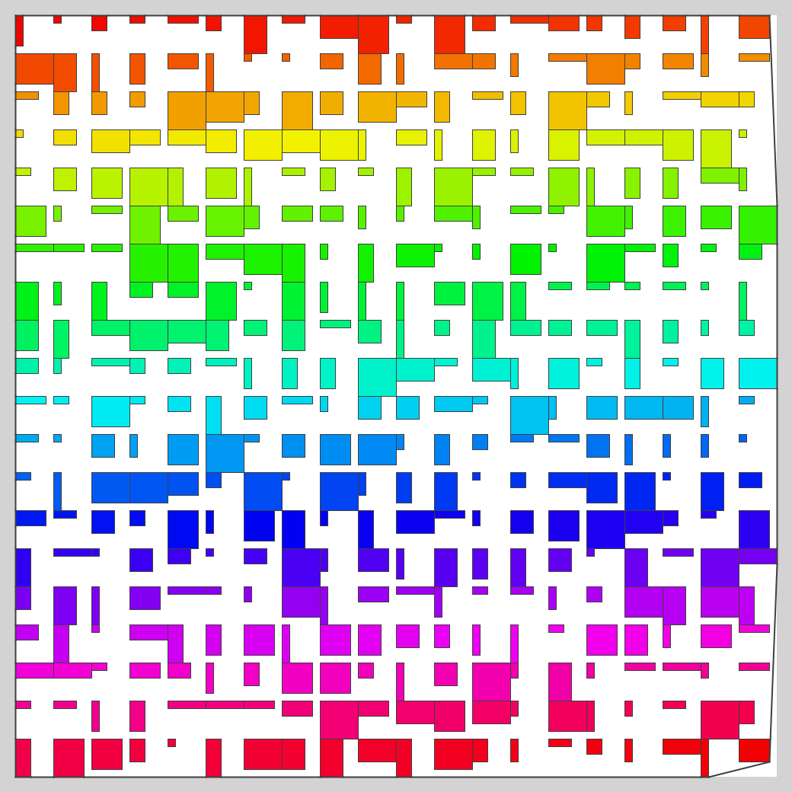

# RPP（Rectangle Packing Problem）

## 問題文
長方形の詰め込み問題です．横幅wi，縦幅hiの長方形iがN個与えられるので，1000 × 1000 の箱の中にはみ出たり重ならないようにしながら，なるべく小さな領域に敷き詰めてください．各長方形i毎に回転ri（90度回転する場合は 1，回転しない場合は 0），左下のxi座標，左下のyi座標を整数で出力してください．ただし，箱の左下の座標を (x, y) = (0, 0) とします．

## 制約
N = 400  
5 <= w, h <= 50  
与えられた 400 個の長方形は必ず 1000 × 1000の箱の中に収まる．

### 入力
```
N
w0 h0
w1 h1
w2 h2
...
wN-1 hN-1
```

### 出力
入力の順番にN個，対応する長方形の位置と回転の情報を出力してください．ri は長方形の回転を表します．0の時は入力と同じ，1の時は90度傾けて配置します．座標は長方形の左下の頂点の座標 xi, yiを整数で出力してください．
```
r0 x0 y0
r1 x1 y1
r2 x2 y2
...
rN-1 xN-1 yN-1
```

## スコア
N個の全ての長方形を詰め込んだ時の高さをスコアとします．具体的には，全ての長方形の四隅の座標の内，最もy座標が大きなものがスコアになります．1000 × 1000の箱から飛び出していたり，長方形同士が重なっている場合 -1となります．

## テスタ
TopCoder の Marathon Match と同じです．```"<command>"```にプログラムの実行コマンド，```<seed>```に乱数のシードを入れてください．
```sh
$ java -jar tester.jar -exec "<command>" -seed <seed>
```
その他オプション
```
-vis  : ビジュアライズ
-save : 画像の保存
```

## 目安？
解き方が分からないので，底に寄せるだけのプログラムを書いた．頑張れば300台は目指せそうです．（高さの最大値は1000）．

1)  638
2)  658
3)  653
4)  641
5)  685
6)  650
7)  741
8)  663
9)  622
10) 656  
  


##  参考文献
