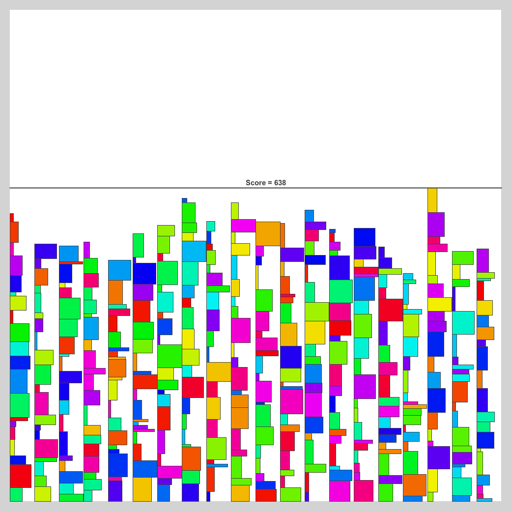

# RPP（Rectangle Packing Problem）

## 問題文
長方形の詰め込み問題っぽいやつです．横幅wi，縦幅hiの長方形RectiがN個与えられるので，100 × 100 の箱の中にはみ出たり重ならないように，なるべく小さな領域に敷き詰めてください．各Recti毎に方向（90度回転する場合は 1，回転しない場合は 0），左上のx座標，左上のy座標を出力してください．

## 制約
N = 400  
1 <= w, h <= 5  
与えられた 400 個の長方形は必ず 100 × 100の箱の中に収まる．

### 入力
```
N
w0 h0
w1 h1
w2 h2
...
wN-1 hN-1
```

### 出力
入力の順番にN個，対応する長方形の位置と回転の情報を出力してください．ri は長方形の回転を表します．0の時は入力と同じ，1の時は90度傾けて配置します．
```
r0 x0 y0
r1 x1 y1
r2 x2 y2
...
rN-1 xN-1 yN-1
```

## スコア
N個の長方形全てを包む凸多角形の面積をスコアとします．具体的には，各長方形の四隅の座標の集合から凸包を作成して面積を計算します．100 × 100の箱から飛び出していたり，長方形同士が重なっている場合 -1となります．

## テスタ
TopCoder の Marathon Match と同じです．```"<command>"```にプログラムの実行コマンド，```<seed>```に乱数のシードを入れてください．
```sh
$ java -jar tester.jar -exec "<command>" -seed <seed>
```
その他オプション
```
-vis  : ビジュアライズ
-save : 画像の保存
```

## 目安？
解き方が分からないので，中央に寄せるだけのプログラムを書いた．これでも半分以下の面積にはできた（最大面積は10000）．頑張れば4000ぐらいにはできそう．  
1)  4797.5
2)  5078.5
3)  4852.5
4)  4857.0
5)  4829.0
6)  4766.5
7)  4976.5
8)  5040.5
9)  4930.0
10) 4857.5  
  


##  参考文献
