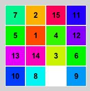

# Sliding Puzzle

## 問題文
15パズルを知ってますか？あれを```N×M```の盤面でより短い手数で解いてください．  
  


## 制約
4 <= N <= 10  
4 <= M <= 10  

### 入力
盤面の大きさとボードの状態が与えられます．```Bi_j```には```1 ~ N×M-1```の数字と，空白を表す```-1```が1つずつ割り当てられます．初期状態から100000回ランダムシャッフルして盤面を生成します．必ず揃えることはできます．seed1 ~ seed7は```4x4 ~ 10x10```の正方形になっています．
```
N M
B0_0 B0_1 ... B0_M-1
B1_0 B1_1 ... B1_M-1
...
BN-1_0 BN-1_1 ... BN-1_M-1
```

### 出力
盤面の数字を```B1_1 -> B1_2 -> ... -> BN_M-1 -> BN_M```の順番に```1 ~ N*M-1```並び替えるための手順を出力してください．
```
入力の盤面の例:
 4 12  3  1
 5 14 11  8
-1 10  7  2
13  6 15  9

並び替えた後の盤面:
 1  2  3  4
 5  6  7  8
 9 10 11 12
13 14 15 -1
```

手順のフォーマットは，移動させるパネルの座標(r,c)です．左上の座標を(0,0)，右下の座標を(r-1,c-1)とします．始めに手順の数```N```を出力して，続く```N```行に手順を出力してください．空白と動かすパネルは隣り合っている必要はない(複数のパネルを一緒にスライドできる)ですが，パネルが動かせない場合や範囲外の座標が指定された場合，その操作は無視されます．
```
N
r1 c1
r2 c2
...
rN cN
```

## スコア
出力の手順に従ってパズルを解きます．最終的な盤面の各パネルの正しい位置からのマンハッタン距離の和を```dist```，手順の操作回数を```count```として，```(dist * 100000) + count```をスコアとします．

## テスタ
TopCoder の Marathon Match と同じです．```"<command>"```にプログラムの実行コマンド，```<seed>```に乱数のシードを入れてください．
```sh
$ java -jar Tester.jar -exec "<command>" -seed <seed>
```
その他オプション
```
-vis            : ビジュアライズ
-delay <second> : 1操作の秒数
```

## 目安？
A-star[1]で解いてみた．9x9以降全然終わらない．  
4x4) 32  
5x5) 154  
6x6) 256  
7x7) 2597  
8x8) 3862  
9x9) -  
10x10) -  

##  参考文献
[1] [Wikipedia A-star](https://ja.wikipedia.org/wiki/A*)
